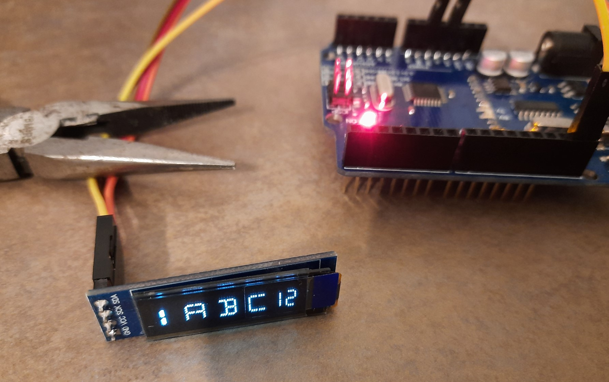
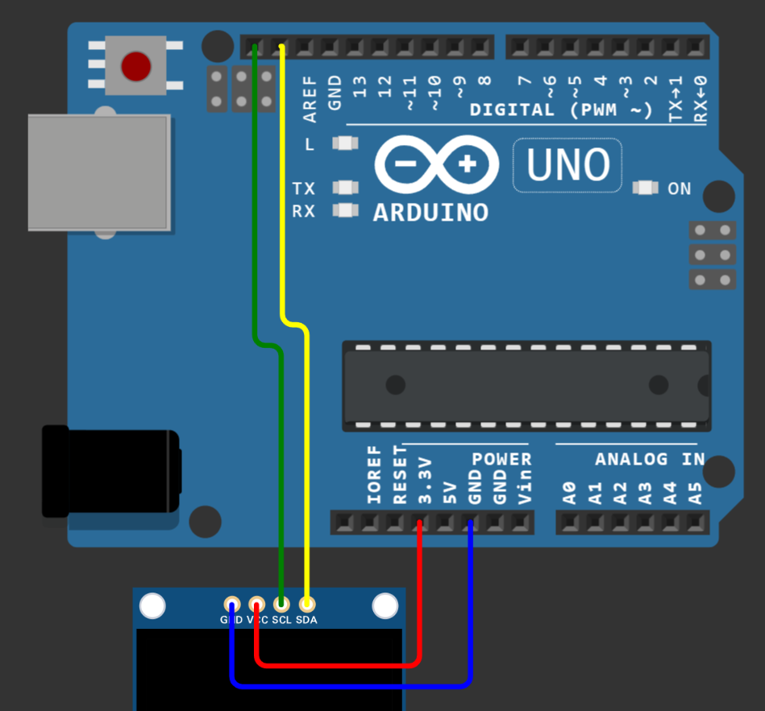

# What is this?

This is a minimal project to demonstrate how to use SkyJunky's custom Hornet fonts with the `u8g2` library.

It was tested with an Arduino Uno and a generic 128x32 pixel 0.92" OLED display connected via i²c.

## Project structure

This project follows the standard [PlatformIO](https://platformio.org/) structure.

The dependencies are specified in `platformio.ini`, the main program code is under `src`.

## Wiring and results

